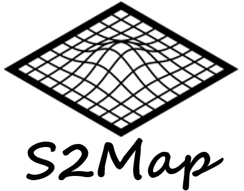

# S2Map: cell-secretion map
## An Online Interactive Platform for Signal Analysis in Cell Secretion-Signal Map
 
---

### Online tool available at: [https://au-s2map.streamlit.app/](https://au-s2map.streamlit.app/)

### Zongliang Yue*, Lang Zhou, Fengyuan Huang, and Pengyu Chen* 
### contact: zzy0065@auburn.edu, pengyuc@auburn.edu

### How to cite us
> S2Map: An Online Interactive Platform for Signal Analysis in Cell Secretion-Signal Map. Bioinformatics (under review)

---

#### Developement Details

Python version used: 3.11.4

---

#### Steps to run on your local server.
1. Download the source code.
2. Install packages mentioned in requirements.txt
3. Run streamlit command line: 
> streamlit run cell_secretion_map.py

---

#### If you need any technical support, please email Zongliang Yue, zzy0065@auburn.edu.

#### Our lab: AI.pharm research group, Health Outcomes Research and Policy, Auburn University, Alabama, USA. Link: https://zongyue1010.github.io/

